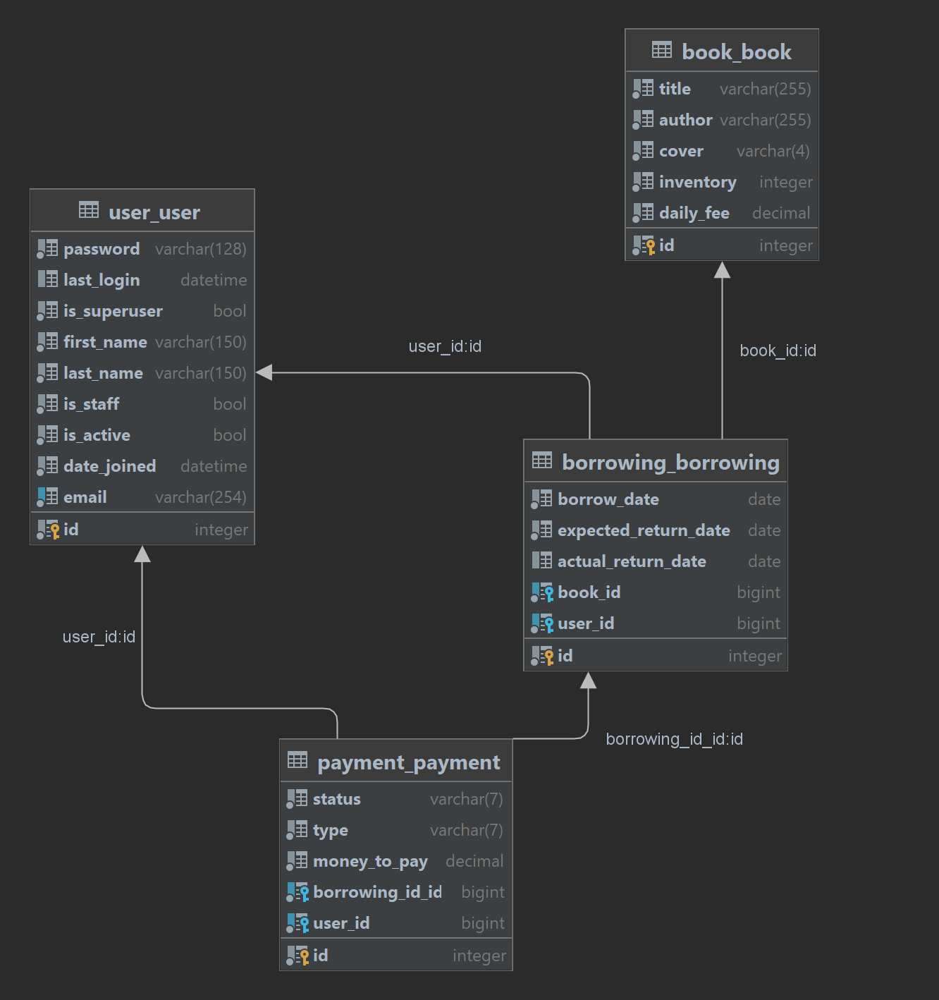

# Library-Service API

API for Library-Service project written using DRF

## Installation 


```shell
git clone https://github.com/HStakhiv/Library-Service.git
cd Library-Service
python -m venv venv
source venv/bin/activate
pip install -r requirements.txt
python manage.py migrate
python manage.py runserver
```

## Getting access

* create user -> http://127.0.0.1:8000/api/user/register/
* get access token -> http://127.0.0.1:8000/api/user/token/

## Features

* JWT authentication
* Managing Payments, Book inventory, Borrowings, Customers directly from the website
* Telegram notification display
* Powerful admin panel for advanced managing
* Detailed documentation

## DB structure
